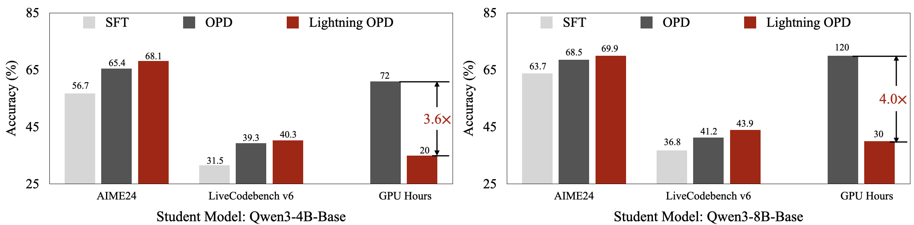
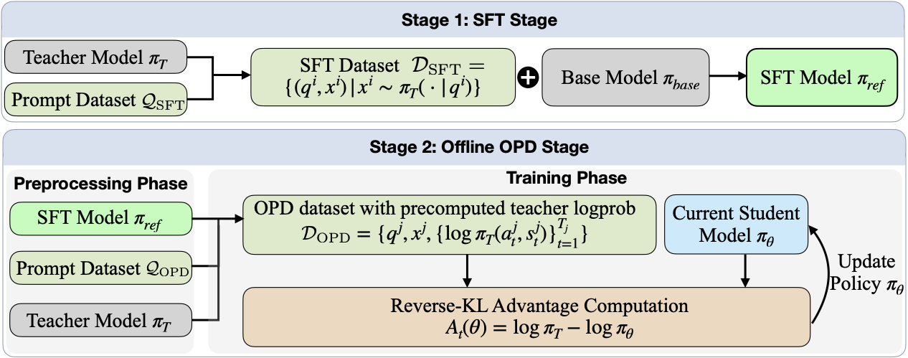
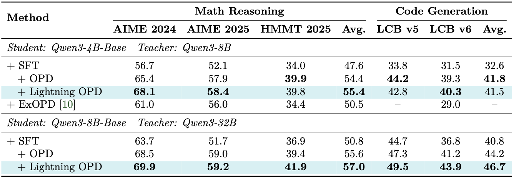
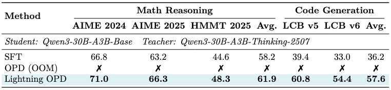
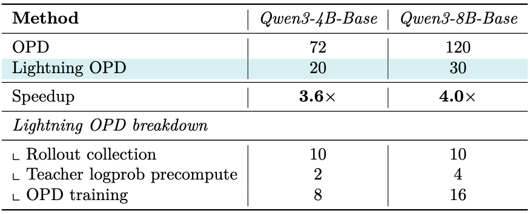

# Lightning OPD: Efficient Post-Training for Large Reasoning Models with Offline On-Policy Distillation

<div align="center">
  <a href="https://arxiv.org/abs/2604.13010"></a> &ensp;
  <a href="https://huggingface.co/Lightning-OPD"></a> &ensp;
</div>

<p align="center">
  
</p>

## 💡 Introduction

Lightning OPD is a new on-policy distillation (OPD) framework that trains a state-of-the-art reasoning model in as little as **30 GPU hours on a single node of 8 H100s**, achieving **69.9% on AIME 2024 at the 8B scale**, matching or surpassing standard OPD across all benchmarks while running **3.6x-4.0x faster** and fully eliminating the need for a live teacher server during training. Lightning OPD further scales to **Mixture-of-Experts (MoE) architectures**, training Qwen3-30B-A3B to **71.0% on AIME 2024** on a single 8×H100 node — a setting where standard OPD runs out of memory.

Standard OPD is highly effective at distilling large reasoning models but requires keeping a large teacher model running as a live server throughout the entire training process, making it expensive and infrastructurally demanding. Lightning OPD resolves this bottleneck through two core contributions:

- **Offline Precomputation:** Teacher log-probabilities are precomputed once over student rollouts before training begins and reused throughout, removing the live teacher dependency entirely.
- **Teacher Consistency:** A principled analysis revealing that the SFT teacher and OPD teacher must be the same model. We prove that violating this condition introduces an irreducible gradient bias, and show that enforcing it is both necessary and sufficient for offline OPD to provably match standard OPD.

<p align="center">
  
</p>

Lightning OPD is evaluated across dense models (Qwen3-4B-Base, Qwen3-8B-Base) and MoE models (Qwen3-30B-A3B-Base) on math reasoning (AIME 2024, AIME 2025, HMMT 2025) and code generation (LiveCodeBench v5/v6). Lightning OPD **matches or exceeds standard OPD** across all benchmark-scale combinations.

<p align="center">
  
</p>
<p align="center">
  
</p>

At the 4B scale, this reduces total GPU hours from **72 to 20** (3.6x speedup). At the 8B scale, from **120 to 30** (4.0x speedup). The infrastructure requirement drops from a multi-node teacher-plus-student setup to a single node for training. For MoE models, Lightning OPD enables on-policy distillation of the 30B-parameter Qwen3-30B-A3B on a single 8×H100 node, where standard OPD is infeasible due to the memory overhead of co-hosting both student and teacher.

<p align="center">
  
</p>

### News

- \[2025.05\] We release the training code for Lightning OPD, including MoE (Qwen3-30B-A3B) support.
- \[2025.04\] We release the [paper](https://arxiv.org/abs/2604.13010) on arXiv.
- Model weights are under legal review and will be released soon. Stay tuned!

### Contents

+ [Installation](#installation)
+ [Quick Reproduction (Qwen3-4B-Base)](#quick-reproduction-qwen3-4b-base)
+ [Standard OPD (Comparison)](#standard-opd-comparison)
+ [8B Scale Configuration](#8b-scale-configuration)
+ [30B MoE Scale Configuration](#30b-moe-scale-configuration)
+ [Hardware Requirements](#hardware-requirements)
+ [Project Structure](#project-structure)
+ [Contact](#contact)
+ [License](#license)
+ [BibTeX](#bibtex)

## Installation

```bash
git clone https://github.com/jet-ai-projects/Lightning-OPD.git
cd Lightning-OPD
```

The pipeline uses three separate environments to avoid dependency conflicts:

### Environment 1: `curation` (Step 0, 1, 3 — data generation)

```bash
conda create -n curation python=3.10 -y
conda activate curation
pip install vllm transformers pyarrow pandas tqdm datasets
```

### Environment 2: `llamafactory` (Step 2 — SFT training)

```bash
conda create -n llamafactory python=3.10 -y
conda activate llamafactory
pip install llamafactory torch transformers
```

### Environment 3: Docker container (Step 4, 5 — logprob precomputation & Lightning OPD training)

Launch the Docker container on a GPU machine:

```bash
bash run_docker.sh
```

Inside the container (sglang, Megatron, torch are pre-installed):

```bash
pip install -e .
```

## Quick Reproduction (Qwen3-4B-Base)

Below is the complete from-scratch reproduction using Qwen3-4B-Base as student and Qwen3-8B as teacher. All commands are run from the `Lightning-OPD/` root directory; intermediate outputs are stored under `data/` and `checkpoints/`.

```
Lightning-OPD/
├── data/
│   ├── prompts/                  # Step 0 output
│   │   └── openthoughts3_300k.jsonl
│   ├── sft_data/                 # Step 1 output
│   ├── rollouts/                 # Step 3 output
│   └── lightning_opd/            # Step 4 output
└── checkpoints/
    └── qwen3-4b-base-sft-qwen3-8b/   # Step 2 output (use your best checkpoint)
```

### Step 0: Prepare SFT Prompts

> Environment: **curation** (`conda activate curation`)

Extract prompts from OpenThoughts3-1.2M and sample 300K for SFT data generation:

```bash
mkdir -p data/prompts

python scripts/prepare_sft_prompts.py \
    --hf-dataset open-thoughts/OpenThoughts3-1.2M \
    --output data/prompts/openthoughts3_300k.jsonl \
    --num-samples 300000
```

This downloads the dataset from HuggingFace, extracts prompt-only fields, and writes a JSONL file. You can also use a local parquet file with `--input data/prompts/local.parquet`.

Download the OPD prompt dataset (DAPO-Math-17k, used in Step 3):

```bash
huggingface-cli download zhuzilin/dapo-math-17k \
    --repo-type dataset \
    --include "*.jsonl" \
    --local-dir data/prompts/dapo-math-17k
```

### Step 1: Generate SFT Data

> Environment: **curation** (`conda activate curation`), GPU node

Use the teacher model to generate training responses on the prepared prompts:

```bash
TEACHER_MODEL=Qwen/Qwen3-8B \
SFT_PROMPTS=data/prompts/openthoughts3_300k.jsonl \
OUTPUT_DIR=data/sft_data \
bash scripts/generate_sft_data.sh
```

The script uses `data_curation/pipeline.py` with vLLM for efficient multi-GPU generation. Each GPU processes a disjoint shard of the dataset. For larger teachers (e.g. Qwen3-32B), set `TP_SIZE=4`. For debugging, append `--num-samples 10` to generate only 10 samples.

Merge the per-rank Arrow files into a single parquet:

```bash
python data_curation/merge.py \
    --input-dir data/sft_data \
    --output data/sft_data/openthoughts3_300k_qwen3-8b.parquet

# Clean up raw Arrow files to save disk space
find data/sft_data -name "*.arrow" -delete
rm -rf data/sft_data/rank*
```

### Step 2: SFT Training

> Environment: **llamafactory** (`conda activate llamafactory`), GPU node

Fine-tune the base model on teacher-generated data using LlamaFactory:

```bash
CONFIG_YAML=qwen3-4b-base-open-thoughts3-qwen3-8b.yaml \
OUTPUT_DIR=checkpoints/qwen3-4b-base-sft-qwen3-8b \
bash configs/sft/run_sft.sh
```

See `configs/sft/qwen3-4b-base-open-thoughts3-qwen3-8b.yaml` for the full SFT configuration (3000 steps, lr=8e-5, packing enabled). By default this runs on 4 nodes x 8 GPUs; adjust `NUM_NODES` and `NUM_GPUS` as needed.

> **Important**: The SFT data must be generated by the *same teacher* used in Step 4. This is the teacher consistency requirement.

### Step 3: Collect Student Rollouts

> Environment: **curation** (`conda activate curation`), GPU node

Use the SFT model to generate responses on OPD prompts (DAPO-Math-17k):

```bash
SFT_CHECKPOINT=checkpoints/qwen3-4b-base-sft-qwen3-8b/<your-sft-checkpoint> \
OPD_PROMPTS=data/prompts/dapo-math-17k/dapo-math-17k.jsonl \
OUTPUT_DIR=data/rollouts \
bash scripts/collect_rollouts.sh
```

Merge the rollout Arrow files into a single parquet:

```bash
python data_curation/merge.py \
    --input-dir data/rollouts \
    --output data/rollouts/dapo-math-17k-qwen3-4b-sft-rollouts.parquet

# Clean up raw Arrow files to save disk space
find data/rollouts -name "*.arrow" -delete
rm -rf data/rollouts/rank*
```

### Step 4: Precompute Teacher Log-Probabilities

> Environment: **container** (`bash run_docker.sh`), Phase 1 is CPU only, Phase 2 needs GPU + sglang

This is the key step that eliminates the need for a live teacher during training.

**Phase 1**: Tokenize rollouts (CPU only):

```bash
mkdir -p data/lightning_opd

python data_curation/prepare_lightning_opd.py \
    --tokenizer-path checkpoints/qwen3-4b-base-sft-qwen3-8b/<your-sft-checkpoint> \
    --input-parquet data/rollouts/dapo-math-17k-qwen3-4b-sft-rollouts.parquet \
    --output-dir data/lightning_opd
```

**Phase 2**: Compute teacher logprobs (requires teacher server):

```bash
# Start teacher server (in a separate terminal)
bash scripts/serve_teacher_8b.sh

# Compute logprobs
python data_curation/prepare_lightning_opd.py \
    --tokenizer-path checkpoints/qwen3-4b-base-sft-qwen3-8b/<your-sft-checkpoint> \
    --input-parquet data/rollouts/dapo-math-17k-qwen3-4b-sft-rollouts.parquet \
    --output-dir data/lightning_opd \
    --compute-teacher-logprobs \
    --teacher-url http://127.0.0.1:13141/generate
```

After this step, you have a parquet file with precomputed `teacher_log_probs` for every token. The teacher server is no longer needed.

### Step 5: Lightning OPD Training

> Environment: **container** (`bash run_docker.sh`, with `pip install -e .`)

Train the student model using precomputed data. No teacher server required.

```bash
export SFT_CHECKPOINT=checkpoints/qwen3-4b-base-sft-qwen3-8b/<your-sft-checkpoint>
export LIGHTNING_OPD_DATA=data/lightning_opd/dapo-math-17k-qwen3-4b-sft-rollouts-lightning-opd-precomputed.parquet

python configs/lightning_opd/qwen3-4b-lightning-opd.py
```

Training uses Megatron + Ray with the slime framework. Key hyperparameters:
- Learning rate: 2e-6 (constant)
- Global batch size: 256
- Max response length: 4096
- Advantage: `log P_teacher(t) - log P_student(t)`
- ~150 steps sufficient for convergence

### Step 6: Convert Megatron Checkpoint to HuggingFace Format

> Environment: **container** (`bash run_docker.sh`)

After training, the checkpoint is saved in Megatron distributed format. Convert it to HuggingFace format for evaluation and deployment:

```bash
MEGATRON_CKPT_DIR=/root/models/<model_name>_ckpt__qwen3-4b-lightning-opd/<your-iteration> \
HF_OUTPUT_DIR=checkpoints/qwen3-4b-lightning-opd-hf \
ORIGIN_HF_DIR=checkpoints/qwen3-4b-base-sft-qwen3-8b/<your-sft-checkpoint> \
bash scripts/convert_megatron_to_hf.sh
```

`MEGATRON_CKPT_DIR` points to an iteration directory inside the Megatron checkpoint (e.g., `iter_0000150`). `ORIGIN_HF_DIR` provides the base HuggingFace config and tokenizer files (typically the SFT checkpoint from Step 2).

## Standard OPD (Comparison)

For comparison, standard OPD requires a live teacher server throughout training:

```bash
export SFT_CHECKPOINT=checkpoints/qwen3-4b-base-sft-qwen3-8b/<your-sft-checkpoint>
python configs/opd/qwen3-4b-opd.py
```

This allocates GPUs for both the actor (training) and the teacher server (rollout scoring), resulting in ~3.6x higher compute cost.

## 8B Scale Configuration

For Qwen3-8B-Base (student) + Qwen3-32B (teacher):

| Step | Config |
|------|--------|
| SFT | `configs/sft/qwen3-8b-base-open-thoughts3-qwen3-32b.yaml` |
| Lightning OPD | `configs/lightning_opd/qwen3-8b-lightning-opd.py` |
| Standard OPD | `configs/opd/qwen3-8b-opd.py` |
| Teacher server | `scripts/serve_teacher_32b.sh` |
| Logprob precompute | `scripts/precompute_teacher_logprobs_8b.sh` |

## 30B MoE Scale Configuration

Lightning OPD scales to Mixture-of-Experts (MoE) architectures, where standard OPD is infeasible due to the memory overhead of co-hosting both student and teacher. On a single 8×H100 node, Lightning OPD trains Qwen3-30B-A3B-Base (30B total parameters, 3B active) using Qwen3-30B-A3B-Thinking-2507 as the teacher.

| Method | AIME 2024 | AIME 2025 | HMMT 2025 | Math Avg. | LCB v5 | LCB v6 | Code Avg. |
|--------|-----------|-----------|-----------|-----------|--------|--------|-----------|
| SFT | 66.8 | 63.2 | 44.6 | 58.2 | 39.4 | 33.0 | 36.2 |
| OPD | OOM | OOM | OOM | OOM | OOM | OOM | OOM |
| **Lightning OPD** | **71.0** | **66.3** | **48.3** | **61.9** | **60.8** | **54.4** | **57.6** |

Standard OPD runs out of memory as it requires co-hosting both a 30B teacher and a 30B student on the same node. Lightning OPD eliminates this bottleneck by precomputing teacher log-probabilities offline, allowing all GPUs to be dedicated to student training.

```bash
export SFT_CHECKPOINT=checkpoints/qwen3-30b-a3b-base-sft/<your-sft-checkpoint>
export LIGHTNING_OPD_DATA=data/lightning_opd/qwen3-30b-a3b-sft-rollouts-lightning-opd-precomputed.parquet

python configs/lightning_opd/qwen3-30b-a3b-lightning-opd.py
```

The MoE training config uses tensor parallelism (TP=4) and expert parallelism (EP=8) to fit the 30B model on 8 GPUs. See `configs/lightning_opd/qwen3-30b-a3b-lightning-opd.py` for full details.

To convert the trained MoE checkpoint to HuggingFace format:

```bash
MEGATRON_CKPT_DIR=/root/models/<model_name>_ckpt__qwen3-30b-a3b-lightning-opd/<your-iteration> \
HF_OUTPUT_DIR=checkpoints/qwen3-30b-a3b-lightning-opd-hf \
ORIGIN_HF_DIR=checkpoints/qwen3-30b-a3b-base-sft/<your-sft-checkpoint> \
bash scripts/convert_megatron_to_hf.sh
```

## Hardware Requirements

| Scale | Step 1, 3: Data Gen | Step 2: SFT | Step 4: Logprob | Step 5: Lightning OPD | Step 5: Standard OPD |
|-------|---------------------|-------------|-----------------|----------------------|---------------------|
| 4B | 1-8 GPUs | 4 nodes x 8 GPUs | 2 GPUs (teacher) | 1 node x 8 GPUs (actor only) | 1 node x 8 GPUs (2 actor + 4 rollout + 2 teacher) |
| 8B | 1-8 GPUs | 4 nodes x 8 GPUs | 8 GPUs (teacher) | 1 node x 8 GPUs (actor only) | 1 node x 8 GPUs (4 actor + 2 rollout + 2 teacher) |
| 30B-A3B (MoE) | 1-8 GPUs | 4 nodes x 8 GPUs | 8 GPUs (teacher) | 1 node x 8 GPUs (actor only) | Infeasible (OOM) |

Lightning OPD training uses all GPUs for the actor since no teacher server is needed.

## Project Structure

```
configs/                 Training configurations
  sft/                   LlamaFactory SFT configs + run script
  lightning_opd/         Lightning OPD training configs
  opd/                   Standard OPD training configs (comparison)
  models/                Megatron model architecture definitions (4B, 8B, 30B-A3B)
scripts/                 Pipeline step scripts
data_curation/           Data processing (generation, merging, logprob precomputation)
slime/                   Training framework (Megatron + Ray + SGLang)
slime_plugins/           Framework plugins
train.py                 Training entry point
data/                    Intermediate data (generated, gitignored)
checkpoints/             Model checkpoints (generated, gitignored)
```

## Acknowledgements

This codebase is built upon [slime](https://github.com/NVIDIA/Megatron-LM) and [LlamaFactory](https://github.com/hiyouga/LLaMA-Factory). We thank the developers of these projects for their excellent work.

## Contact

+ [Yecheng Wu](mailto:yechengw@nvidia.com)
+ [Song Han](https://hanlab.mit.edu/songhan)
+ [Han Cai](http://hancai.ai/)

## Contributing

This project is currently not accepting contributions.

## License

+ [Code](./LICENSE)
+ [Third-Party Notices](./THIRD_PARTY_NOTICES.md)

## BibTeX

```bibtex
@article{wu2026lightning,
  title={Lightning OPD: Efficient On-Policy Distillation for Large Reasoning Models without Live Teacher Serving},
  author={Wu, Yecheng and Han, Song and Cai, Han},
  year={2026}
}
```
